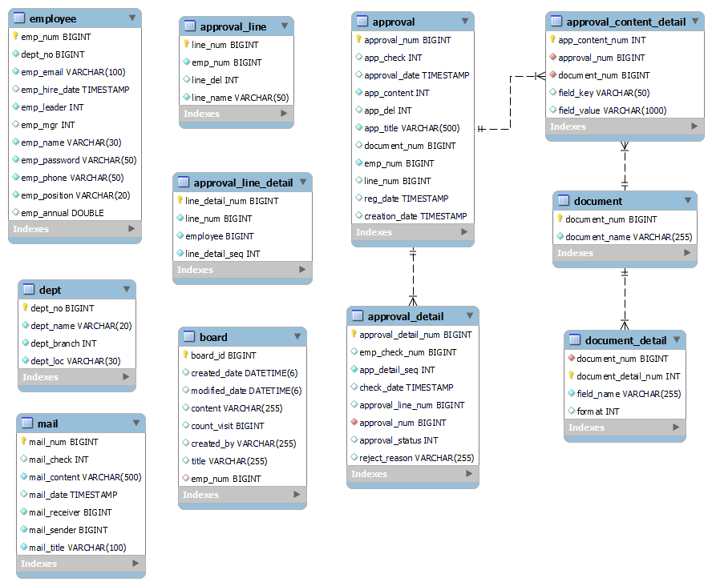

# Appsolute
**전자 결재 시스템** 입니다.   

### 개발 기간
* 2023.09.18 ~ 2023.10.19 (약 한달)  

### 팀원 구성
* **팀장 : 본인 - ERD 설계, 결재 기능, 발표**
* 팀원1 : 로그인/마이 페이지 기능, 소스 통합
* 팀원2 : 공지사항 게시판, CSS
* 팀원3 : 정보 수정, 사원 검색 등 관리 기능
* 팀원4 : 메세지 기능, 소스 통합  

### 개발 환경
* Java 11
* **프레임워크** : Spring boot(2.7.15)
* **데이터베이스** : Mysql - MyBatis
* **프론트** : thymeleaf, javascript, jQuery  

### 나의 역할
* **ERD 설계**
  
  

<b>ERD 이미지</b>

  

    
  

문서의 종류마다 테이블을 추가하지 않고도 데이터를 저장하고 불러올 수 있도록 구성함

* **기능 구현**
  

<b>문서 작성 기능</b>

  

    
  

     * 작성하는 사람의 정보는 로그인 정보로 자동으로 입력됨
     * 작성한 문서에 결재를 받을 사람을 선택하여 올릴 수 있다.
     * 

  

<b>시험 접수 기능</b>

  

    
  

  
     * 시험 상세 페이지에서 접수 가능
     * 현재 접수 가능한 시험만 접수 버튼이 보임
     * 접수 가능한 인원이 있고 초과되면 접수 불가능함
     * 같은 시험의 이전 회차와 다음 회차로 이동할 수 있다

  

<b>시험 관리 기능</b>

  

    
    
  

     * 관리자는 시험을 추가하고 삭제할 수 있다
     * 시험 회차는 선택한 시험에 따라 알맞는 회차가 자동으로 설정된다(이전회차 +1)
     * 관리자로 로그인하면 시험 일정 조회 페이지에서 시험을 삭제할 수 있다

